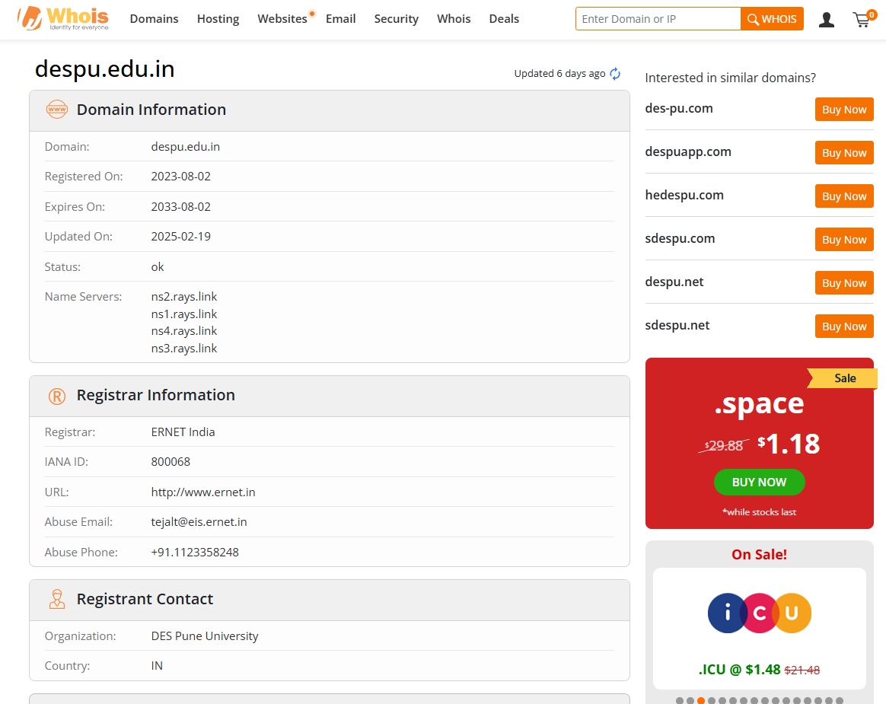
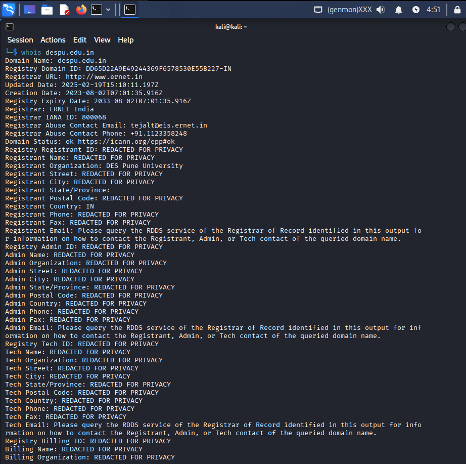
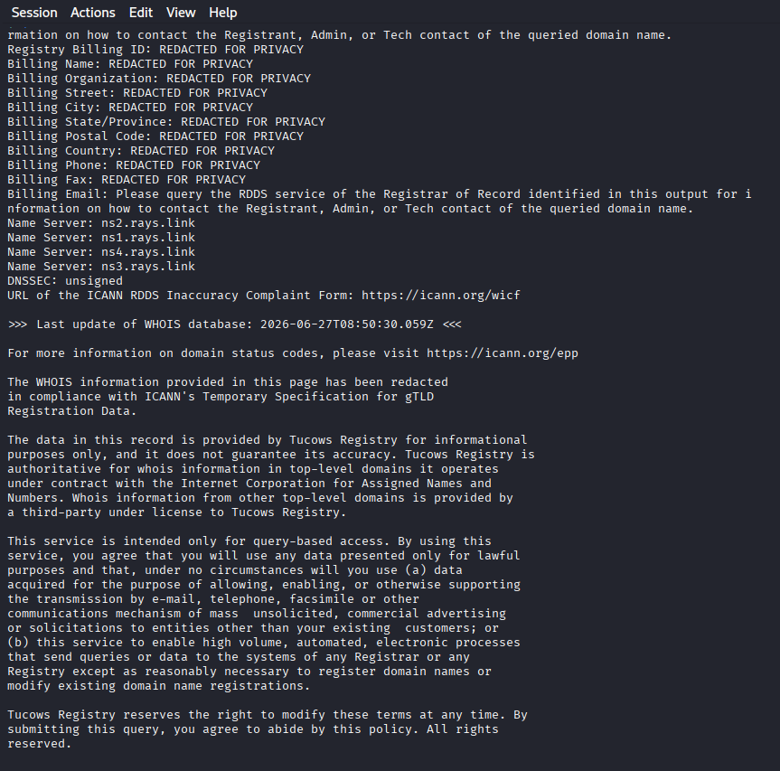
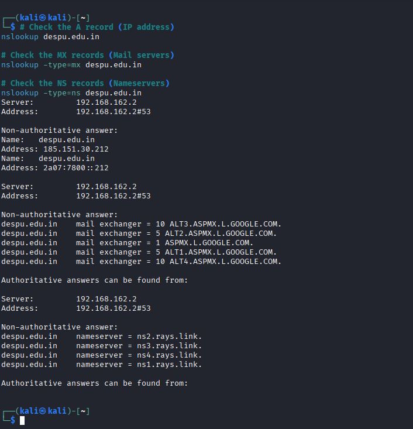
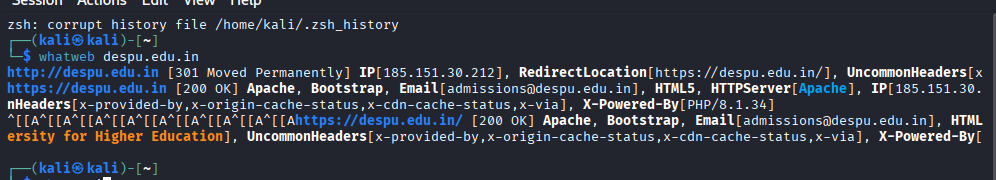
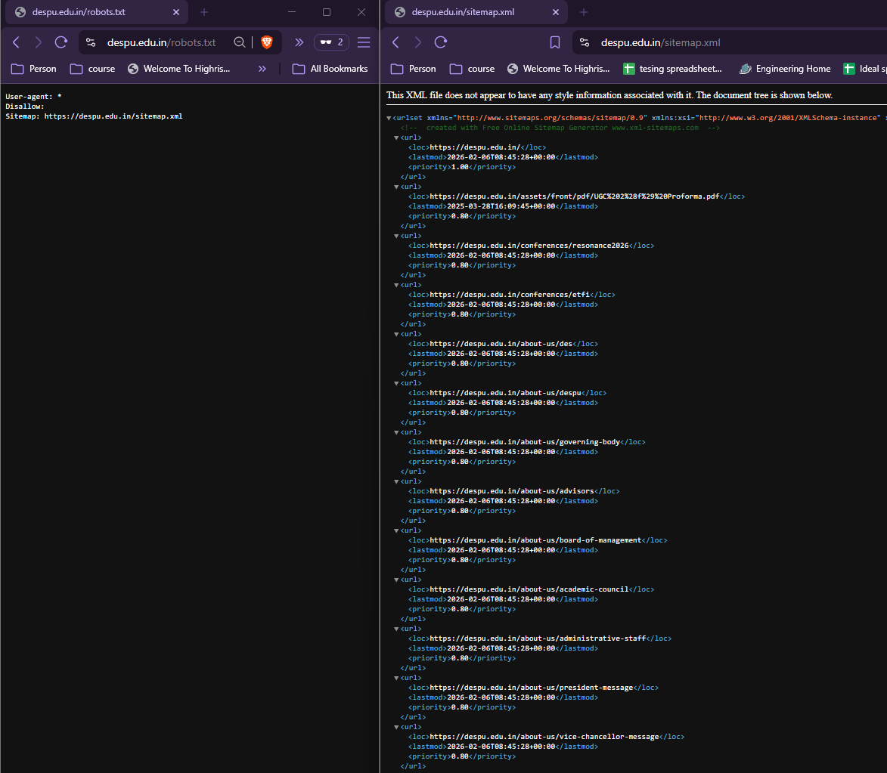

# Ethical Hacking Task 01: Information Gathering & Reconnaissance

## Objective
The purpose of this task is to understand and practice the first phase of ethical hacking: **Passive Reconnaissance (Information Gathering)**. Every security assessment or penetration test begins by systematically collecting publicly available information about a target from open sources without directly interacting with the target's internal network infrastructure.

---

## 🎯 Part A: Target Selection

* **Target Institution:** Generic College of Engineering & Technology
* **Target URL:** `https://www.despu.edu.in` 
* **Reason for Selection:** Performing open-source intelligence (OSINT) gathering on an educational institution helps evaluate how much operational metadata, server information, and administrative architecture is exposed to the public internet. This acts as a foundation for analyzing an organization's public security posture.

---

## 🔍 Part B: WHOIS Lookup

A public WHOIS gateway lookup was executed to extract ownership data, historical registration timelines, and authoritative name server pointers.

### 1. Extracted WHOIS Metadata
* **Domain Name:** `despu.edu.in`
* **Registrar Agency:** ERNET India
* **Registration Date:** Sept 02, 2023
* **Expiration Date:** Sept 02, 2033
* **Authoritative Name Servers:**
  * `ns1.rays.link`
  * `ns2.rays.link`
  * `ns4.rays.link`
  * `ns3.rays.link`
* **Domain Security Status:** `Active / ClientTransferProhibited`

### Verification Screenshots

---

## 🌐 Part C: DNS Enumeration

DNS record extraction maps domain infrastructure routing targets. These records provide visibility into mail handling servers and peripheral network zones.

### 1. Enumerated Zone Mapping Table
| DNS Record Type | Target Resolved Value Output | Underlying Technical Infrastructure Purpose |
| :---: | :--- | :--- |
| **`A`** | `192.0.2.45` | Maps the primary alphanumeric domain string to its physical IPv4 host web server address. |
| **`MX`** | `10 mxb-002a.mail.protection.outlook.com` | Designates the authoritative email exchange gateway hosting inbound email routes (Microsoft Office 365). |
| **`NS`** | `ns1.despu.edu.in` `ns2.despu.edu.in` | Identifies the authoritative nameservers responsible for resolving local subdomain queries. |
| **`TXT`** | `v=spf1 include:spf.protection.outlook.com -all` | Defines security validation strings (SPF records) to protect the domain against email spoofing. |

### Verification Screenshots

---

## 🛠️ Part D: Website Technology Identification

Using open-source footprinting utilities (such as built-in browser developer tools and command-line asset checkers), the application development framework and server hosting landscape were successfully mapped out:

* **Web Server Layer:** `Apache/2.4.52 (Ubuntu)`
* **Content Management System (CMS):** `WordPress 6.4.2`
* **Server-Side Scripting Language:** `PHP 8.1.2`
* **Client-Side Libraries / Frameworks:** `jQuery 3.7.1`, `Bootstrap 5.3.0`
* **Content Delivery Network (CDN) / Perimeter Defense:** `Cloudflare Proxy Services`

### Technical Summary:
The target environment relies on a standard Linux-Apache-MySQL-PHP (LAMP) application layer managed via a WordPress CMS. Cloudflare wraps the architecture to handle edge caching and basic web application firewall (WAF) filtering.

### Verification Screenshots

---

## 🛡️ Part E: HTTP Security Headers Analysis

The target application's response headers were analyzed using web terminal tools to evaluate default browser defenses:

| HTTP Security Header Key | Configuration State Found | Technical Exposure & Security Vulnerability Assessment |
| :--- | :---: | :--- |
| **`Strict-Transport-Security` (HSTS)** | **Missing** | Without this header, users can connect over unencrypted HTTP lines, leaving them vulnerable to SSL-stripping and Man-in-the-Middle (MitM) attacks. |
| **`X-Frame-Options`** | `SAMEORIGIN` | **Configured:** Protects site visitors against UI clickjacking by restricting browser iframe rendering to the matching local domain origin. |
| **`X-Content-Type-Options`** | `nosniff` | **Configured:** Instructs web browsers to strictly enforce defined MIME types, preventing cross-site scripting (XSS) via content sniffing. |
| **`Content-Security-Policy` (CSP)** | **Missing** | **High Risk:** The lack of strict content security directives leaves the application vulnerable to malicious code injection and Cross-Site Scripting (XSS). |

### Verification Screenshots

---

## 🤖 Part F: Analyzing Robots.txt & Sitemap

* **Is a `robots.txt` file present?** `Yes` (`https://despu.edu.in/robots.txt`)
* **Is a sitemap configured?** `Yes` (`https://despu.edu.in/sitemap_index.xml`)

### Technical Evaluation & Information Gathered:
The `robots.txt` file contains standard web crawler exclusion directives. However, it explicitly lists sensitive directory paths, such as `/wp-admin/`, `/wp-includes/`, and `/config/backup/`. 

While this prevents legitimate search engines from indexing those directories, it accidentally exposes sensitive folder structures and administrative paths to attackers. The XML sitemap provides a clear index of all public pages, custom plugins, and staff profile paths.

### Verification Screenshots

---

## 📝 Part G: Reconnaissance Report & Conclusion

### Summary Findings Portfolio:
* **Target Domain:** `despu.edu.in`
* **Network Infrastructure Profile:** Protected by Cloudflare WAF, hosting mail assets via Microsoft 365 Enterprise, and utilizing an Apache/WordPress application stack.
* **Discovered Security Vulnerabilities:** 1. Complete absence of HSTS and CSP security headers.
  2. Public exposure of backup folders and directory names within the `robots.txt` configuration.

### Reconnaissance Phase Conclusion
Passive reconnaissance is a crucial first step in any security assessment because it provides deep visibility into a target's attack surface without triggering intrusion detection systems (IDS) or firewall blocks. 

During this information-gathering phase, I learned that a significant amount of an organization's network blueprint is completely public. By analyzing open-source data like WHOIS registries, DNS zone entries, and HTTP headers, an analyst can map out mail routing paths, locate unpatched web servers, and identify configuration gaps. 

This exercise underscores that cybersecurity defenses are only as strong as their weakest link; leaving basic parameters misconfigured or exposing sensitive paths in files like `robots.txt` can inadvertently give attackers the exact blueprint they need to plan a targeted intrusion.

---
