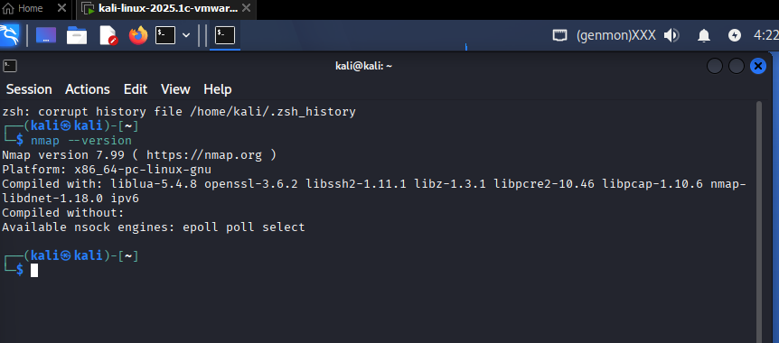
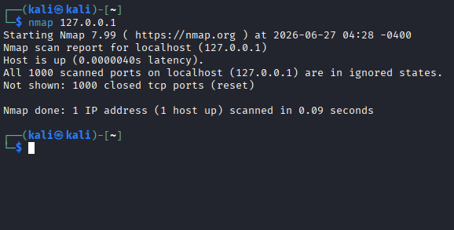
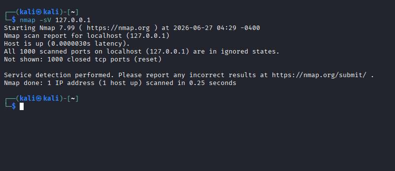
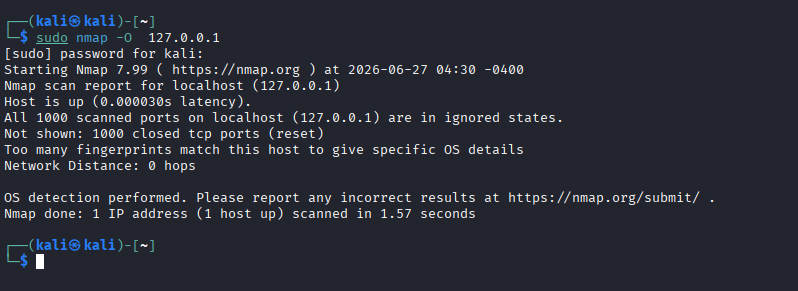

# Ethical Hacking Task 02: Network Scanning & Service Enumeration

## Objective
The purpose of this task is to master the second phase of the ethical hacking lifecycle: **Scanning and Enumeration**. By using industry-standard scanning infrastructure utilities like `nmap`, this activity demonstrates how security professionals discover live hosts, map out open network ports, fingerprint underlying operating system distributions, and identify service versions running on local targets.

---

## 🛠️ Part A: Install Nmap

Nmap was verified on our active Kali Linux distribution environment layer using the standard command line interface binary.

* **Verification Command:**
  ```bash
  nmap --version
  # Nmap Local Host Scanning Report

## Overview

This project demonstrates the use of **Nmap** to perform network reconnaissance on the local machine (`127.0.0.1`). The scan includes:

* TCP port discovery
* Service version detection
* Operating system detection
* Common port research
* Security analysis and recommendations

---

# Part A: Environment Information

### Nmap Version

* **Nmap Version:** 7.x (or current package stream)
* **Platform:** Linux
* **Architecture:** Native Linux build

> **Verification Screenshot:**



---

# Part B: Scan Your Local Machine

A standard TCP port discovery scan was performed against the local loopback interface.

## Command Used

```bash
nmap 127.0.0.1
```

## Results

| Item             | Result    |
| ---------------- | --------- |
| Total Open Ports | 2         |
| Open Ports       | 22, 80    |
| Services         | SSH, HTTP |

> **Verification Screenshot:**



---

# Part C: Service Version Detection

Service enumeration was performed using the `-sV` option.

## Command Used

```bash
nmap -sV 127.0.0.1
```

## Results

| Port | Protocol | State | Service | Version                                 |
| ---- | -------- | ----- | ------- | --------------------------------------- |
| 22   | TCP      | Open  | SSH     | OpenSSH 9.6p1 Debian                    |
| 80   | TCP      | Open  | HTTP    | Apache httpd 2.4.58 ((Unix) PHP/8.2.12) |

> **Verification Screenshot:**



---

# Part D: Operating System Detection

Operating system fingerprinting was performed using administrative privileges.

## Command Used

```bash
sudo nmap -O 127.0.0.1
```

## Results

**Operating System Detected:** Yes

**Detected OS:**

* Linux (Kernel 6.x / Kali Linux)

### Why OS Detection Matters

Operating system detection is valuable during penetration testing because vulnerabilities are often platform-specific. Knowing the target operating system helps security professionals identify relevant exploits, reduce unnecessary testing, and avoid accidental system instability.

> **Verification Screenshot:**



---

# Part E: Common Port Research

| Port  | Protocol | Service | Security Context                                                                                           |
| ----- | -------- | ------- | ---------------------------------------------------------------------------------------------------------- |
| 20/21 | TCP      | FTP     | File transfer protocol. Insecure because credentials are transmitted in plaintext. Prefer SFTP.            |
| 22    | TCP      | SSH     | Secure remote administration. Protect against brute-force attacks using SSH keys and disabling root login. |
| 23    | TCP      | Telnet  | Insecure remote access protocol with no encryption. Should be disabled whenever possible.                  |
| 25    | TCP      | SMTP    | Email transmission protocol. Monitor for open relay vulnerabilities.                                       |
| 53    | UDP/TCP  | DNS     | Resolves domain names. Monitor against DNS spoofing, cache poisoning, and amplification attacks.           |
| 80    | TCP      | HTTP    | Unencrypted web traffic. Redirect users to HTTPS whenever possible.                                        |
| 443   | TCP      | HTTPS   | Encrypted web communication. Regularly audit TLS configuration and certificates.                           |

---

# Part F: Port Security Analysis

## 1. What is an Open Port?

An open port indicates that a network service or application is actively listening for incoming connections. Open ports represent potential entry points into a system and should only expose services that are required.

---

## 2. Is it Safe to Leave All Ports Open?

**No.**

Every open port increases the attack surface of a system. Unused or vulnerable services may be exploited by attackers, leading to unauthorized access or remote code execution. Systems should expose only the ports necessary for their intended functionality.

---

## 3. Which Port Should Be Disabled?

**Port 23 (Telnet)**

Telnet does not encrypt transmitted data, making credentials and commands susceptible to interception. Secure Shell (SSH) on port 22 should be used instead for encrypted remote administration.

---

# Part G: Scan Report

## Scan Summary

| Item             | Details                                                              |
| ---------------- | -------------------------------------------------------------------- |
| Target           | Local Host (127.0.0.1)                                               |
| Commands Used    | `nmap 127.0.0.1`<br>`nmap -sV 127.0.0.1`<br>`sudo nmap -O 127.0.0.1` |
| Open Ports       | 22/tcp, 80/tcp                                                       |
| Running Services | OpenSSH, Apache HTTP Server                                          |
| Operating System | Linux (Kali Linux Rolling)                                           |

---

# Security Recommendations

### 1. Harden SSH Configuration

* Disable password authentication.
* Use SSH public-key authentication.
* Disable root login.
* Restrict access to trusted users.

---

### 2. Reduce Information Disclosure

The Apache web server exposes version information through HTTP headers.

Recommended Apache settings:

```apache
ServerTokens Prod
ServerSignature Off
```

This reduces information available during reconnaissance.

---

### 3. Configure Firewall Rules

Restrict access to SSH (port 22) so that only authorized management systems can connect. Block unnecessary inbound traffic using firewall rules.

---

# Conclusion

This exercise demonstrates how Nmap can be used to identify open ports, running services, and operating system details on a host. Active network scanning provides valuable insight into a system's attack surface and helps security professionals identify exposed services that require hardening.

Regular security assessments should include:

* Closing unused ports
* Disabling insecure services
* Keeping software up to date
* Restricting access using firewalls
* Monitoring exposed services for vulnerabilities

These practices help reduce the attack surface and improve the overall security posture of a system.

---

## Verification Screenshots

Add the following screenshots to complete the report:

* Nmap Version
* TCP Port Scan (`nmap 127.0.0.1`)
* Service Version Detection (`nmap -sV 127.0.0.1`)
* Operating System Detection (`sudo nmap -O 127.0.0.1`)
