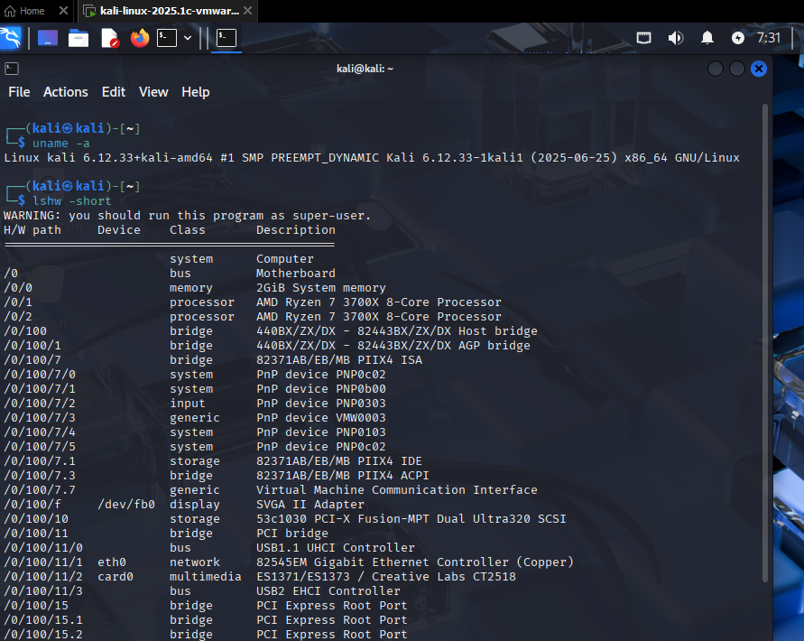
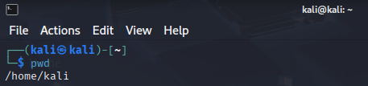
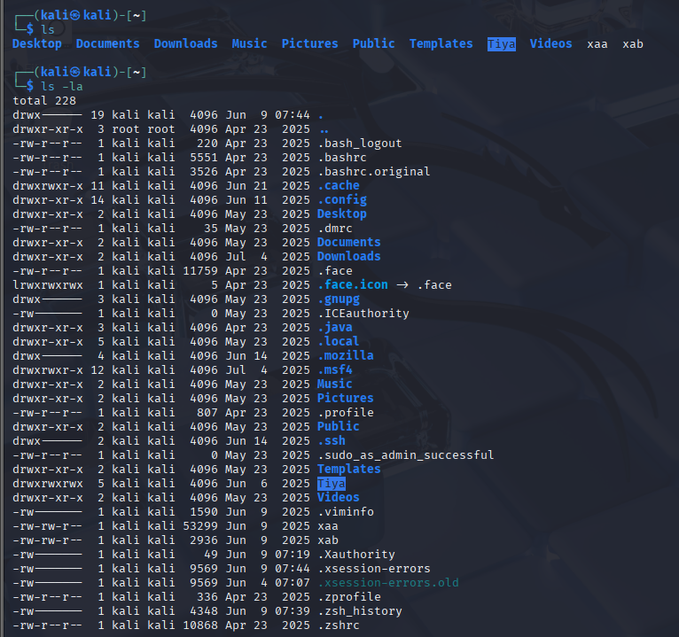
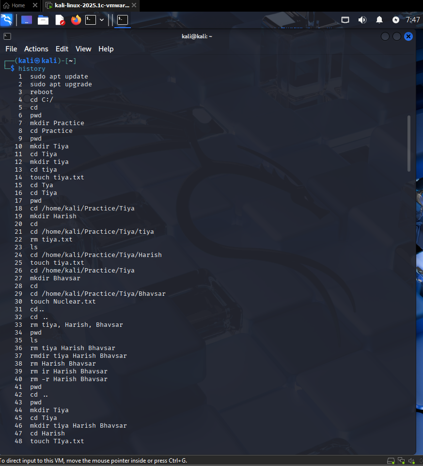
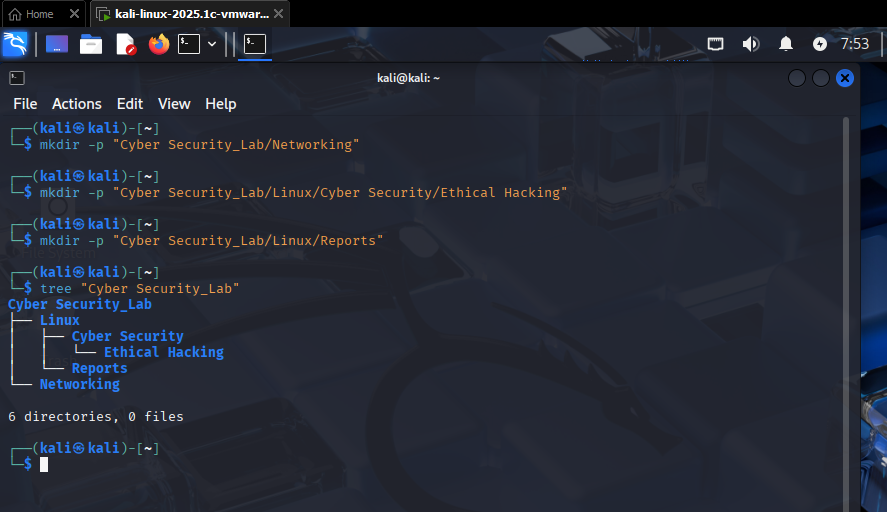

# Linux Task 01: Linux Environment Setup & Essential Commands

## Objective

The purpose of this task is to become familiar with the Linux operating system, terminal interface usage, directory navigation, and core file management utilities. Linux serves as a fundamental environment for Cyber Security professionals, System Administrators, and Ethical Hackers.

---

## 🖥️ Part A: Linux Installation & Verification

For this environment setup, **Kali Linux** was successfully deployed inside a virtual machine (VM) container.

### System Verification Screenshots

* [x] Desktop Environment initialized
* [ ] 


* [x] Active Terminal window functional
* [ ] 


* [x] Base system parameters verified
* [ ] 

---

## 🧭 Part B: Basic Navigation Commands

The execution metrics for foundational shell traversal commands inside the bash environment are detailed below:

* **`pwd` (Print Working Directory):**

  * **Purpose:** Displays the absolute directory path of the current shell focus.
  * **Output Example:** `/home/kali`
  * 
 

* **`ls` (List Storage Contents):**

  * **Purpose:** Lists non-hidden files and subdirectories located within the current working folder.

* **`ls -la` (List All Long Format):**

  * **Purpose:** Lists all system file elements in long-form details, including hidden configuration files (those prefixed with a dot `.`), along with permissions, file sizes, ownership information, and modification timestamps.
  * 


* **`cd` (Change Directory):**

  * **Purpose:** Changes the current shell context to a specified directory. Running it without parameters returns the user to the home directory (`~`).

* **`clear` (Reset Screen):**

  * **Purpose:** Clears previous terminal output from the visible screen, providing a clean workspace.

* **`history` (Command Log Review):**

  * **Purpose:** Displays a chronological list of previously executed commands in the current shell session.
  * 


* **`whoami` (Identity Verification):**

  * **Purpose:** Displays the username of the currently logged-in user.
  * **Output:** `kali`

* **`hostname` (Device Domain ID):**

  * **Purpose:** Displays the logical name assigned to the local device or virtual machine.
  * **Output:** `kali`

---
## 📁 Part C: Directory Management

The directory hierarchy was created using the `mkdir` utility with the `-p` option, which automatically generates parent directories when they do not already exist.

### 1. Directory Creation Commands

```bash
mkdir -p "Cyber Security_Lab/Networking"
mkdir -p "Cyber Security_Lab/Linux/Cyber Security/Ethical Hacking"
mkdir -p "Cyber Security_Lab/Linux/Reports"
```

### 2. Directory Structure Verification

The `tree` command was used to display and verify the complete directory hierarchy:

```bash
tree "Cyber Security_Lab"
```

### 3. Resulting Directory Structure

```text
Cyber Security_Lab/
├── Networking/
└── Linux/
    ├── Cyber Security/
    │   └── Ethical Hacking/
    └── Reports/
```


### 4. Operations Summary

* Created the root directory `Cyber Security_Lab`.
* Generated the `Networking` subdirectory.
* Built a nested directory path for `Linux/Cyber Security/Ethical Hacking`.
* Created the `Reports` directory under the Linux section.
* Verified the final directory hierarchy using the `tree` utility.

# Part F: Linux Research Activity

## 1. What is Linux?

Linux is an open-source, Unix-like operating system kernel created by Linus Torvalds in 1991. The kernel serves as the core component that manages communication between software applications and computer hardware. Due to its flexibility and modular design, Linux is used as the foundation for many operating system distributions designed for different purposes.

## 2. Why is Linux Important in Cyber Security?

Linux plays a critical role in cyber security because it provides extensive control over system resources, network configurations, and security settings. Security professionals use Linux to analyze network traffic, manage permissions, perform vulnerability assessments, and develop security tools. Additionally, most servers, cloud platforms, and network devices run Linux, making Linux knowledge essential for protecting modern IT infrastructure.

## 3. Difference Between Linux and Windows

| Feature        | Linux                                                                 | Windows                                                       |
| -------------- | --------------------------------------------------------------------- | ------------------------------------------------------------- |
| Source Code    | Open-source and freely available                                      | Proprietary and closed-source                                 |
| User Interface | Primarily command-line based, with optional GUIs                      | Primarily graphical user interface (GUI)                      |
| Customization  | Highly customizable                                                   | Limited customization                                         |
| Security Model | Strong permission-based access control using root and sudo privileges | Uses User Account Control (UAC) and administrative privileges |
| Cost           | Usually free                                                          | Requires a commercial license                                 |

## 4. What is a Linux Distribution?

A Linux distribution (or distro) is a complete operating system built around the Linux kernel. It includes system utilities, software packages, desktop environments, and package management tools. Different distributions are designed for specific purposes. Examples include Ubuntu for general use, Debian for stability, and Kali Linux for cyber security and penetration testing.

## 5. Why Do Ethical Hackers Prefer Linux-Based Operating Systems?

Ethical hackers prefer Linux-based operating systems because they offer powerful command-line tools, advanced networking capabilities, and extensive customization options. Security-focused distributions such as Kali Linux come pre-installed with penetration testing, vulnerability assessment, and digital forensics tools. Linux also supports scripting and automation, enabling security professionals to perform complex tasks efficiently and effectively.

## Conclusion

Linux is a powerful, secure, and highly customizable operating system that serves as the backbone of modern computing infrastructure. Its widespread use in servers, cloud environments, and cyber security makes it an essential skill for IT professionals and ethical hackers. Understanding Linux fundamentals helps build a strong foundation for system administration, network security, and penetration testing.


