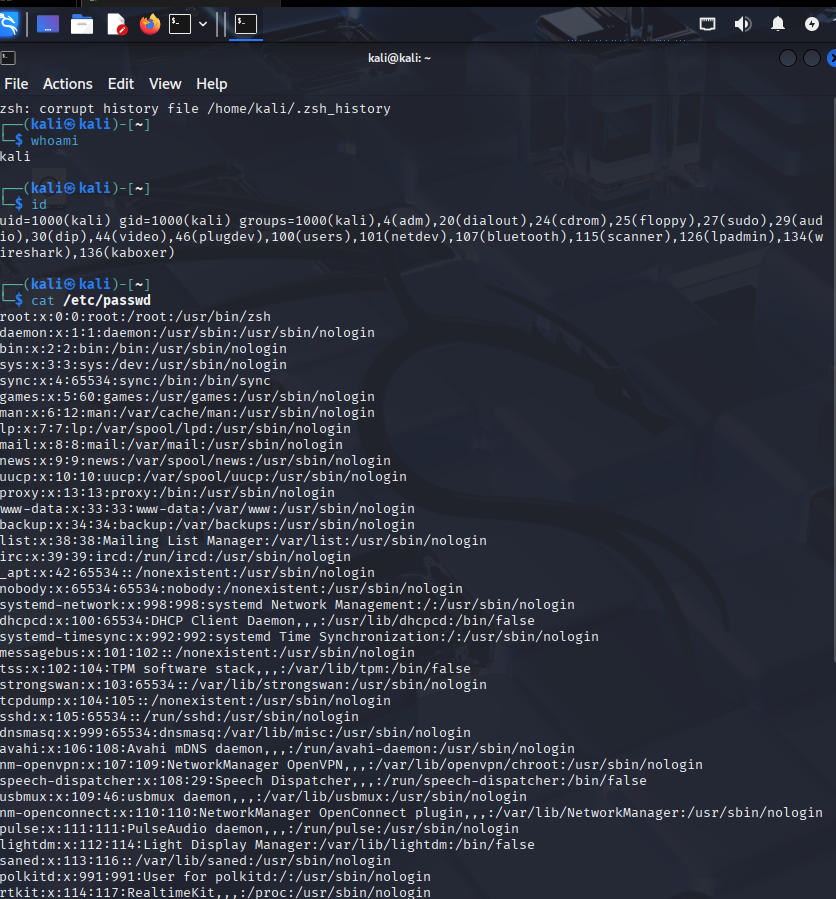
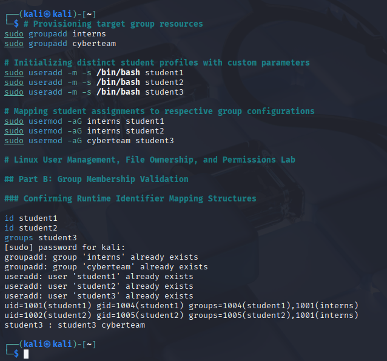
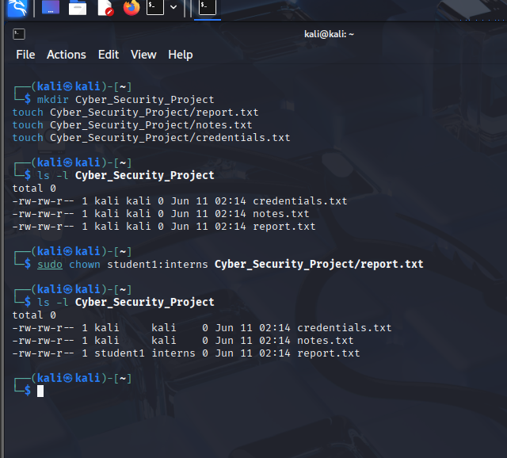
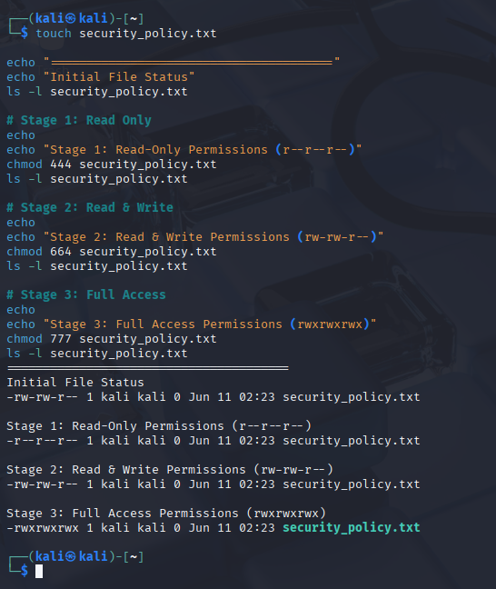

# Linux Task 02: Users, Groups & File Permissions

## Objective
The purpose of this task is to master Linux user administration, multi-tenant group provisioning, resource ownership modification, and absolute/symbolic system file permissions configurations[cite: 293].

# 👥 Part A: Understanding Users

## 1. Diagnostic Questions & Answers

### What is your current username?

Based on the local environment values, the active user context is:

```
kali
```

### What is UID?

The **User Identifier (UID)** is a unique numeric value assigned by the Linux kernel to every user account. It is used to enforce security policies, track ownership of files and processes, and manage user privileges.

* The **root** account is assigned UID `0`.
* Regular user accounts typically have UIDs greater than or equal to `1000`.
* System and service accounts generally use lower UID ranges.

### What is GID?

The **Group Identifier (GID)** is a unique numeric identifier assigned to a group. It defines a user's primary group membership and enables multiple users to share common access permissions for files and directories.

### What information does `/etc/passwd` contain?

The `/etc/passwd` file stores essential information about user accounts on a Linux system. Each entry contains colon-separated fields representing:

1. Username
2. Password Placeholder (`x`)
3. User ID (UID)
4. Primary Group ID (GID)
5. GECOS/User Description
6. Home Directory
7. Login Shell

Example entry:

```text
kali:x:1000:1000:Kali User:/home/kali:/bin/bash
```

## Verification Screenshots



---

# 🛠️ Part B: Create Users & Groups

## 1. System Engineering Sequence

To establish isolated execution environments for different teams and users, Linux administrative utilities were used to create groups and user accounts.

### Create Groups

```bash
sudo groupadd interns
sudo groupadd developers
```

### Create User Accounts

```bash
sudo useradd -m -s /bin/bash student1
sudo useradd -m -s /bin/bash student2
sudo useradd -m -s /bin/bash student3
```

### Assign Users to Groups

```bash
sudo usermod -aG interns student1
sudo usermod -aG interns student2
sudo usermod -aG developers student3
```

### Set User Passwords

```bash
sudo passwd student1
sudo passwd student2
sudo passwd student3
```

### Verify User and Group Creation

```bash
id student1
id student2
groups student3
```

## Verification Screenshots



---

# Part C: File Ownership

## 1. Target Infrastructure Layout

The project directory workspace was built using standard structural path elements:

```bash
mkdir Cyber_Security_Project
touch Cyber_Security_Project/report.txt
touch Cyber_Security_Project/notes.txt
touch Cyber_Security_Project/credentials.txt
```

## 2. Ownership Modification Log

The `chown` utility was applied to change file assignments to other user accounts.

### Target File Path

```text
Cyber_Security_Project/report.txt
```

### Original Owner Constraints

* User: `kali`
* Group: `kali`

### New Owner Mapping

* User: `student1`
* Group: `interns`

### Command Sequence Executed

```bash
sudo chown student1:interns Cyber_Security_Project/report.txt
```

**Verification Screenshots:**


---

# Part D: File Permissions

The permissions matrix on our core security template file was adjusted step-by-step using numeric and symbolic notation.

```bash
touch security_policy.txt
```

## Permissions Lifecycle Stages

### Stage 1: Read-Only System Enforcement (Absolute Isolation)

**Command Used**

```bash
chmod 400 security_policy.txt
```

or

```bash
chmod u=r,go= security_policy.txt
```

**Result Layout**

```text
r--------
```

### Stage 2: Standard Team Collaboration Setup

**Command Used**

```bash
chmod 664 security_policy.txt
```

or

```bash
chmod ug=rw,o=r security_policy.txt
```

**Result Layout**

```text
rw-rw-r--
```

### Stage 3: Full Public Execution Context (Unrestricted)

**Command Used**

```bash
chmod 777 security_policy.txt
```

or

```bash
chmod ugo=rwx security_policy.txt
```

**Result Layout**

```text
rwxrwxrwx
```

**Verification Screenshots:**


---

# Part E: Permission Analysis

An in-depth assessment of common octal permission values reveals the following security configurations:

| Permission | Owner Rights                 | Group Rights                 | Other User Rights            | Real-World Target Use Case                                                                                                          |
| ---------- | ---------------------------- | ---------------------------- | ---------------------------- | ----------------------------------------------------------------------------------------------------------------------------------- |
| **755**    | Read, Write, Execute (`rwx`) | Read, Execute (`r-x`)        | Read, Execute (`r-x`)        | Public binary application directories (e.g., `/usr/bin`) where everyone can execute tools, but only administrators can modify them. |
| **644**    | Read, Write (`rw-`)          | Read-Only (`r--`)            | Read-Only (`r--`)            | Standard web server configuration documents or public notices where visitors only view assets.                                      |
| **777**    | Read, Write, Execute (`rwx`) | Read, Write, Execute (`rwx`) | Read, Write, Execute (`rwx`) | Testing environments; strongly discouraged in production due to severe security risks.                                              |
| **600**    | Read, Write (`rw-`)          | No Access (`---`)            | No Access (`---`)            | High-security credentials such as SSH private keys (`~/.ssh/id_rsa`).                                                               |
| **700**    | Read, Write, Execute (`rwx`) | No Access (`---`)            | No Access (`---`)            | Private user directories (e.g., `/root`) that must remain inaccessible to others.                                                   |

---

# Part F: Security Challenge

Recommended file authorization profiles for a secure system environment:

| File Target Asset     | Recommended Octal | Assigned Permissions | Technical Defense Justification                                                                                            |
| --------------------- | ----------------- | -------------------- | -------------------------------------------------------------------------------------------------------------------------- |
| `password_backup.txt` | **600**           | `rw-------`          | Contains highly sensitive secrets. Access must be restricted strictly to the file owner to prevent credential leaks.       |
| `public_notice.txt`   | **644**           | `rw-r--r--`          | Intended for public viewing. The owner retains modification rights while others have read-only access.                     |
| `system_log.txt`      | **640**           | `rw-r-----`          | Critical debugging data. Administrators can read/write logs, while auditing tools may read them without modifying records. |
| `personal_notes.txt`  | **700**           | `rwx------`          | Private operational workspace data. Protects user scripts and drafts from unauthorized access.                             |

---

# Part G: Linux Security Research

## 1. Why Are File Permissions Important?

File permissions serve as the primary security boundaries in multi-user operating systems. They enforce data integrity, isolation, and access control by ensuring that unauthorized users cannot read sensitive documents, modify configuration settings, or execute untrusted binaries.

## 2. What Happens If Sensitive Files Are Given 777 Permissions?

Applying global read, write, and execute permissions (`777`) removes essential security protections. Any user or process on the system can access, modify, delete, or misuse the file, potentially resulting in data breaches, privilege escalation, or complete system compromise.

## 3. What Is the Principle of Least Privilege (PoLP)?

The Principle of Least Privilege (PoLP) states that users, applications, and automated services should only be granted the minimum permissions required to perform their intended tasks. Restricting access reduces the attack surface and limits damage if an account becomes compromised.

## 4. Why Do Organizations Restrict User Access?

Organizations restrict user access to:

* Minimize insider threats and accidental modifications.
* Protect sensitive information from unauthorized disclosure.
* Maintain compliance with security standards and regulations.
* Reduce opportunities for privilege abuse and data exfiltration.
* Improve overall system security and accountability.

---

## Conclusion

This lab demonstrated essential Linux administration and security concepts, including user and group validation, file ownership management, permission assignment, permission analysis, and security best practices. Proper implementation of file permissions and access controls is critical for maintaining confidentiality, integrity, and availability in multi-user environments.

