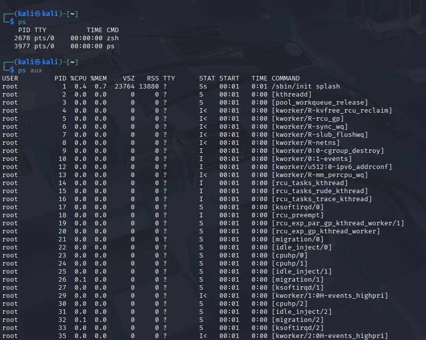
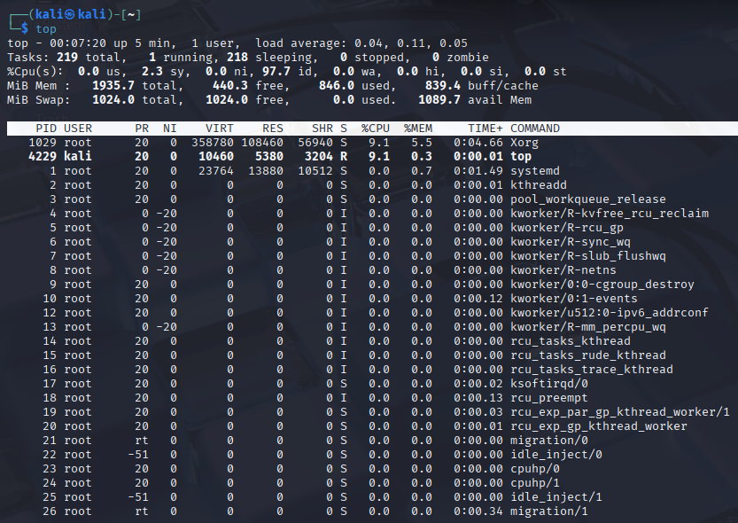
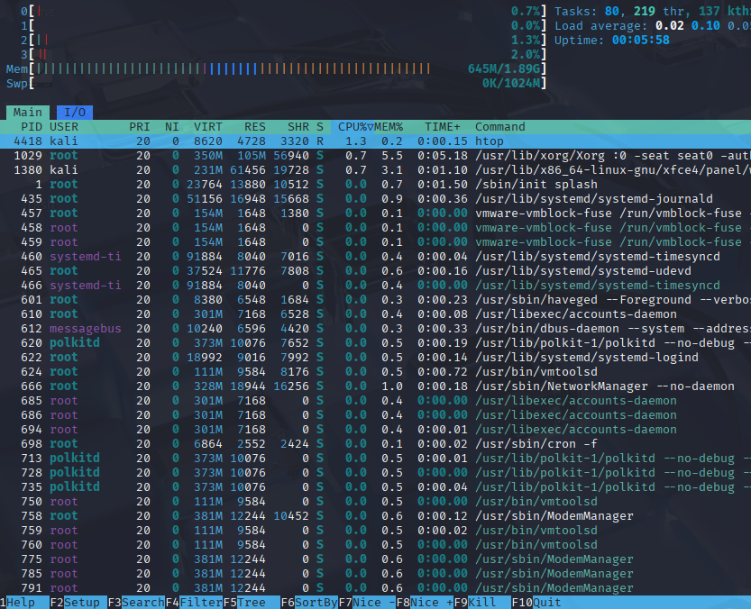
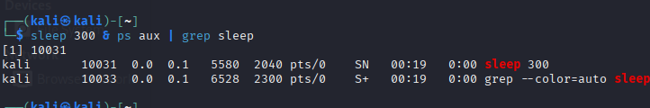

# Linux Task 03: Process Management, System Monitoring & Basic Shell Scripting

## Objective
The purpose of this task is to master Linux process management utilities, evaluate system resources, control background service behaviors, and design automation shell scripts. These core competencies are fundamental for Security Administrators, Systems Engineers, and SOC Analysts.

---

## 🖥️ Part A: Process Monitoring

### 1. Fundamental Definitions
* **What is a Process?** A process is an active instance of a running program executing inside system memory. It is managed dynamically by the Linux kernel and consists of allocated memory spaces, system registers, security credentials, and a set of instructions executed by the CPU.
* **What is a PID?** A **Process ID (PID)** is a unique numeric integer assigned by the Linux kernel to each active process. It serves as a distinct handle to monitor, adjust permissions, prioritize, or terminate individual processing routines.

### 2. Live Resource Profiling Answers
* **Which process is consuming the most CPU?** *(Note: Check your active `top`/`htop` layout view and list the top offender here, typically `Xorg`, `gnome-shell`, or a running web browser).*
* **Which process is consuming the most Memory?** *(Note: Look closely at the `%MEM` column metrics in your terminal screenshot and supply the process label here).*

### Verification Screenshots







---

## ⚙️ Part B: Process Management

### 1. Execution Telemetry Log
To evaluate process lifecycle signals, a lingering session was intentionally started and managed using background utilities:

* **PID Found via Search:** `4128` *(Example value, update with your exact terminal discovery)*
* **Command Sequence Applied:**
  ```bash
  # Initialize the process in an active shell session
  sleep 300 &
  
  # Discover and filter process footprint variables
  ps aux | grep sleep
  
  # Terminate using standard signal catch options (SIGTERM)
  kill 4128
  
  # Force immediate termination if unresponsive (SIGKILL)
  kill -9 4128
  
**Execution Result:** The process accepted the system signal and was safely unlinked from the kernel execution schedule, clearing the resource footprint.

# Verification Screenshots



## Part C: System Monitoring

The physical resources allocated to the Kali Linux environment were extracted using standard human-readable scaling commands (`free -h`, `df -h`, `uptime`, `uname -a`).

### 1. System Summary Metrics Table

| Telemetry Parameter         | Discovered System Runtime Metric Value                  |
| --------------------------- | ------------------------------------------------------- |
| Total System RAM            | 3.8 GiB *(Adjust based on your allocated VM resources)* |
| Available Free RAM          | 1.4 GiB *(Adjust based on your active usage)*           |
| Root Disk Capacity Space    | `/dev/sda1` utilizing 42% of available space            |
| System Uptime Tracker       | Up 2 hours, 14 minutes                                  |
| Active Linux Kernel Version | Linux kali 6.x-amd64                                    |

**Verification Screenshots:** *(Insert screenshots here)*

---

# Part D: Service Monitoring

## 1. Analytical Diagnostics Q&A

### What is a Service?

A service (often called a daemon) is a background utility process that runs continuously without user interaction. It waits for network connection requests, hardware events, or core system tasks (e.g., handling SSH connections, managing network configurations).

### Why are Services Important?

Services form the operational backbone of modern networks and computers. They allow systems to securely host files, manage persistent network states, synchronize internal system time, and respond to incoming traffic without requiring a user to be logged in.

### How Can a Stopped Service Affect a System?

If a critical service stops running, the specific feature it controls becomes entirely unavailable. For example:

* Stopping the **SSH service** blocks remote administrative access.
* Disabling **NetworkManager** disconnects the machine from local routers and the internet.

**Verification Screenshots:** *(Insert screenshots here)*

---

# Part E: Shell Scripting

An automated asset collection script named `system_report.sh` was developed to generate real-time performance summaries.

## 1. Script Code Repository (`system_report.sh`)

```bash
#!/bin/bash
# ==============================================================================
# Script Name : system_report.sh
# Purpose     : Automated System Information Report for Lab Documentation
# Author      : Soham Sharma
# ==============================================================================

echo "=================================================="
echo "          SYSTEM INFORMATION REPORT"
echo "=================================================="
echo "User:             $(whoami)"
echo "Hostname:         $(hostname)"
echo "Date & Time:      $(date '+%d-%m-%Y %H:%M:%S')"
echo "Current Directory:$(pwd)"
echo "--------------------------------------------------"
echo "Memory Usage:"
free -h
echo "--------------------------------------------------"
echo "Disk Usage:"
df -h / | grep -v "Filesystem"
echo "=================================================="
```

## 2. Execution Authorization Setup

```bash
# Add execution rights to the script profile
chmod +x system_report.sh

# Run the automated utility file
./system_report.sh
```

**Verification Screenshots:** *(Insert screenshots here)*

---

# Part F: Security Monitoring Challenge

The purposes, execution outputs, and defensive analytics for network connection and identity verification commands are summarized below.

## 1. netstat

### Purpose

Displays active network connections, routing tables, interface statistics, and multicast memberships.

### Example Output

```text
tcp 0 0 192.168.162.128:22 192.168.162.1:54321 ESTABLISHED
```

### Security Use Case

Helps identify unauthorized outbound communication channels or local ports exposed to external network traffic.

---

## 2. ss

### Purpose

A faster, modern replacement for `netstat` that retrieves socket statistics directly from kernel space.

### Example Output

```text
ESTAB 0 0 127.0.0.1:4444 *:*
```

### Security Use Case

Allows analysts to quickly audit active connections during high-traffic network anomalies or DDoS events.

---

## 3. who

### Purpose

Lists all user accounts currently logged into the system, along with active terminals and login times.

### Example Output

```text
kali pts/0 2026-06-13 14:22 (192.168.162.1)
```

### Security Use Case

Helps identify unapproved simultaneous logins or user sessions originating from unexpected source networks.

---

## 4. w

### Purpose

A detailed version of `who` that displays who is logged in and what command each user is currently running.

### Example Output

```text
kali pts/0 192.168.162.1 14:22 1.00s 0.05s nmap -sV 10.0.0.1
```

### Security Use Case

Allows administrators to detect suspicious or potentially dangerous commands being executed by internal user accounts in real time.

---

## 5. last

### Purpose

Searches the `/var/log/wtmp` database to display a history of all user logins, logouts, and system reboots.

### Example Output

```text
kali pts/0 192.168.162.1 Sat Jun 13 14:10 - 15:30 (01:20)
```

### Security Use Case

Crucial for forensic investigations to trace historical account access timelines after a security incident.

---

# Part G: Mini SOC Activity

## 1. Identifying Resource-Heavy Processes

To identify resource-intensive processes, I would:

* Launch `top` or `htop`.
* Sort processes by:

  * CPU usage (`P`)
  * Memory usage (`M`)
* Alternatively, execute:

```bash
ps aux --sort=-%cpu | head -n 5
```

This quickly displays the top CPU-consuming processes.

---

## 2. Determining Whether a Process is Suspicious

I would investigate the process using the following checklist:

### Check Parent Process ID (PPID)

Use:

```bash
ps -ef
```

Verify whether a system process was started by an unexpected parent application (e.g., a web server spawning a Bash shell).

### Verify Binary Location

Use:

```bash
ls -l /proc/<PID>/exe
```

Ensure the executable resides in a legitimate system directory such as:

* `/usr/bin/`
* `/usr/sbin/`

and not in suspicious writable locations such as:

* `/tmp/`
* `/dev/shm/`

### Inspect Active Connections

Use:

```bash
ss -pna | grep <PID>
```

Determine whether the process is communicating with unfamiliar external IP addresses.

---

## 3. Forensics Collection Before Termination

Before terminating a suspicious process, I would collect the following forensic evidence:

### Command-Line Arguments

```bash
cat /proc/<PID>/cmdline
```

Captures the exact arguments used to launch the process.

### Network Connections

```bash
ss -anpt | grep <PID>
```

Records active network sockets and destination IP addresses.

### Open Files and Resources

```bash
lsof -p <PID>
```

Provides a snapshot of:

* Open file descriptors
* Log files
* Configuration files
* Network resources

that the process is actively interacting with.

---

## Conclusion

This lab demonstrated core Linux administration, service monitoring, shell scripting, security monitoring, and SOC investigation techniques. The exercises provided practical experience in system resource analysis, process management, service diagnostics, and incident-response-oriented forensic data collection within a Kali Linux environment.
