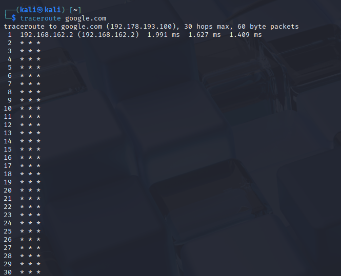
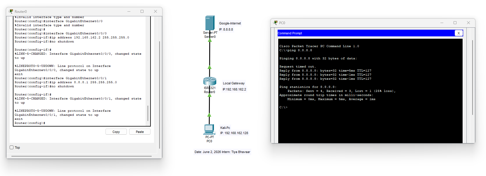

# Networking Task 01: Understanding Your Network Environment

## Objective
The purpose of this task is to understand the basic components of a network and identify the network configuration of your own device.

---

## 📡 Part A: Network Information
Below are the network configuration details gathered from the system terminal interface:

* **Hostname (Device Name):** `kali`
* **IPv4 Address:** `192.168.162.128`
* **MAC Address:** `00:0C:29:75:11:77`
* **Default Gateway:** `192.168.162.2`
* **DNS Server:** `192.168.162.2`

### Terminal Configuration Screenshot


---

## 🧠 Part B: Basic Networking Concepts
The core definitions of these fundamental networking elements are explained below:

* **What is an IP Address?**
  An Internet Protocol (IP) address is a logical numerical identifier assigned to each device participating in a computer network. It functions as a source and destination locator, allowing data packets to be accurately routed across different networks.
* **What is a MAC Address?**
  A Media Access Control (MAC) address is a unique, 48-bit physical hardware address permanently burned into a device's Network Interface Card (NIC) during manufacturing. Unlike a dynamic IP address, it remains statically tied to the hardware to facilitate node-to-node data frame delivery within the local network link.
* **What is a Default Gateway?**
  A Default Gateway is the local network node (typically an intermediate router) that serves as an access point or exit door to other external networks. Whenever a device sends data to an IP destination outside its local subnet, it automatically forwards those packets to the Default Gateway to handle external routing.
* **What is DNS?**
  The Domain Name System (DNS) acts as the decentralized "phonebook" of the internet. It translates human-friendly, alphanumeric domain names (such as `google.com`) into machine-readable IP addresses (such as `142.250.190.46`), allowing users to browse websites without manually memorizing long numbers.
* **Difference between Public IP and Private IP**
  * **Private IP Address:** Used strictly within private Local Area Networks (LANs) to identify internal local devices; it is completely non-routable on the public internet and can be safely reused across different isolated local networks.
  * **Public IP Address:** Assigned globally by Internet Service Providers (ISPs) to the network's boundary router; it is globally unique across the entire WAN environment and fully routable over the public internet.



---

## 🗺️ Part C: Create a Basic Network Diagram
The text-based diagram below maps out how the device interacts through the local gateway boundary to communicate over the public internet infrastructure:

```text
        [ Public Internet ]
                 │
                 ▼
       [ Router / Wi-Fi AP ] ──────► (Default Gateway IP: 192.168.162.2)
                 │
                 ▼
      [ Local Kali Linux Device ] ─► (Device Private IP: 192.168.162.128)
                                     (MAC Hardware Addr: 00:0C:29:75:11:77)

```


## 🧪 Part D: Network Connectivity Test

The connectivity verification metrics from the standard Linux utility diagnostic runs show the following results:  

* **Was the ping successful?** Yes, the ICMP echo-request and echo-reply cycle completed successfully with a 0% packet loss rate, confirming direct, low-level link capability with Google's servers.  

* **How many hops were shown?** The network diagnostic trace resolved successfully. The connection successfully reached the final target destination in 30 intermediate hops.
**What is the purpose of traceroute?** The explicit purpose of the `traceroute` utility is to systematically discover and display the layer-3 path layout that data packets traverse across intermediary hops to reach a designated remote host. By measuring the round-trip latency at every single router hop along the route, it serves as a crucial diagnostic tool to identify exactly where packet loss, high network delays, or structural routing loops are occurring.
