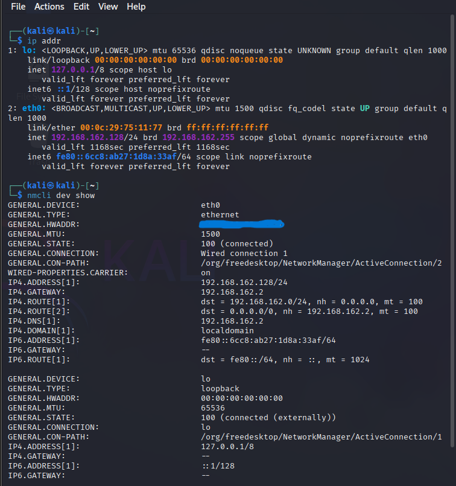
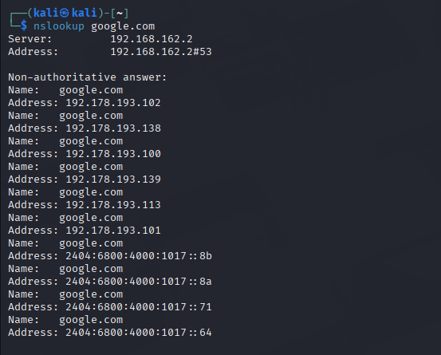
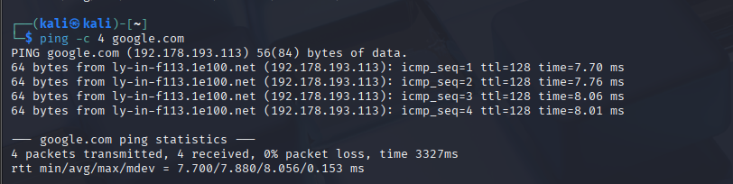

# Networking Task 02: Network Devices & IP Addressing

## Objective
The purpose of this task is to understand common network devices, IP addressing concepts, and how data travels within a network environment.

---

## 🛠️ Part A: Network Devices Research

### 1. Router
* **Purpose:** Connects multiple distinct networks together (e.g., your local home network to the internet) and routes data packets between them across layer 3 of the OSI model.
* **How it works:** It maintains a routing table and analyzes incoming data packets for their destination IP addresses, determining the most efficient path or "next hop" to forward the data.
* **Real-world usage:** The home Wi-Fi router provided by your Internet Service Provider (ISP) that bridges your local smart devices to the global internet.

### 2. Switch
* **Purpose:** Connects multiple devices together within the *same* Local Area Network (LAN) to facilitate internal data sharing.
* **How it works:** Operates at layer 2 (Data Link) and inspects incoming data frames for their destination MAC addresses, directly forwarding the traffic only to the specific physical port where the destination device is connected.
* **Real-world usage:** An enterprise switch in a university computer lab linking dozens of desktop computers to a local server.

### 3. Hub
* **Purpose:** An legacy network device used to connect multiple devices in a local network.
* **How it works:** It acts as a non-intelligent physical layer repeater. When it receives a data packet on one port, it blindly broadcasts (copies) that packet out to all other ports, leading to heavy network congestion and collision risks.
* **Real-world usage:** Outdated legacy systems; mostly replaced by modern intelligent switches due to security and efficiency flaws.

### 4. Access Point (AP)
* **Purpose:** Extends a wired network structure into a wireless environment, allowing devices to connect via Wi-Fi.
* **How it works:** Connects directly to a wired router or switch via an Ethernet cable and transmits wireless radio signals (SSID), bridging wireless client devices to the main wired infrastructure.
* **Real-world usage:** Wireless access points mounted on ceilings in corporate offices to give laptop users seamless Wi-Fi roaming.

### 5. Firewall
* **Purpose:** Acts as a security barrier that monitors and filters incoming and outgoing network traffic based on an established set of security rules.
* **How it works:** Inspects packet headers, protocols, ports, and states against defined Access Control Lists (ACLs) to permit safe traffic while blocking malicious unauthorized access requests.
* **Real-world usage:** Next-Generation Firewalls protecting a corporate data center from external hacker scans or DDoS attacks.

### 6. Modem
* **Purpose:** Converts signals between your ISP's infrastructure and your home router, bridging different physical transmission media.
* **How it works:** Performs **MO**dulation (converting digital data from a computer into analog signals for telephone/cable lines) and **DEM**odulation (converting incoming analog signals back into digital data).
* **Real-world usage:** A fiber-optic or cable modem connected to the wall outlet that brings raw broadband internet into your household.
---

## 🔢 Part B: IP Address Classification

| IP Address | Category | Technical Explanation |
| :--- | :--- | :--- |
| **192.168.1.10** | **Private** | Falls squarely inside the RFC 1918 Class C private reservation block (`192.168.0.0` to `192.168.255.255`). |
| **10.0.0.5** | **Private** | Reserved inside the RFC 1918 Class A private network allocation block (`10.0.0.0` to `10.255.255.255`). |
| **172.16.5.20** | **Private** | Allocated within the RFC 1918 Class B private reservation block range (`172.16.0.0` to `172.16.31.255`). |
| **8.8.8.8** | **Public** | Globally unique, publicly routable address outside private ranges, famously managed as Google's Public DNS server. |
| **1.1.1.1** | **Public** | Globally unique, publicly routable anycast address operated openly as Cloudflare's Public DNS resolver. |
| **192.168.100.1** | **Private** | Belongs directly to the RFC 1918 Class C private network block, widely used as a default local gateway for modems. |

---

## 🖥️ Part C: Understanding Your Network

Based on our local Kali Linux deployment configurations, here are the system metrics:
* **IPv4 Address:** `192.168.162.128`
* **Default Gateway:** `192.168.162.2`
* **DNS Server:** `192.168.162.2`

### Questions & Answers:
1. **Which IP range does your device belong to?** The device belongs to the Class C private IP range (`192.168.162.0/24`), with a subnet mask of `255.255.255.0`.
2. **Is it Public or Private?** It is a **Private** IP address. It is strictly used for internal communication within the virtual local area network environment and cannot be routed across the public internet.
3. **What role does your router play in your network?** The router serves as the essential intermediary edge gateway. It receives local traffic, alters private source IPs into a singular public IP via Network Address Translation (NAT), and securely forwards packets toward internet destinations.
4. **What would happen if the DNS server stopped working?** If the DNS server stopped working, you would no longer be able to resolve human-readable domain names (like `google.com`) into their numeric IP locations. You would lose the ability to browse websites using standard web addresses, though direct connections made using raw IP addresses (like `8.8.8.8`) would technically still connect.

 
### Terminal Configuration Screenshot


---

## 🗺️ Part D: Network Communication Flow
Below is the sequential communication pathway mapped out when a local web browser requests access to `www.google.com`:

```text
[ Kali Device ] ──(1. DNS Query)──► [ DNS Server ]
      │                                   │
(4. HTTP Request via Gateway)        (2. Resolves Domain to IP)
      │                                   │
      ▼                                   ▼
[ Local Router ] ─(3. Returns IP)─────────┘
      │
      ├──(5. NAT Routing over WAN)──► [ Google Server ]
      │                                     │
      ◄──(6. Sends HTTP Response Back)──────┘
```
# How a Browser Loads `www.google.com`

## Step 1: DNS Resolution Request

The local browser first checks its DNS cache for the domain `www.google.com`.

- If a cached entry exists, it uses that information directly.
- If no cached entry is found, the browser sends an outbound **UDP DNS query** to the configured local DNS server.
- The query requests the IP address associated with `www.google.com`.

---

## Step 2: DNS Address Retrieval

The DNS server processes the request and performs a lookup.

- It locates the DNS records associated with `www.google.com`.
- The server retrieves the corresponding public IP address.
- The resolved IP address is returned to the client machine.

**Example:**

```text
www.google.com → 142.250.x.x
```

---

## Step 3: TCP Three-Way Handshake Establishment

After obtaining the destination IP address, the client initiates a TCP connection.

The standard **TCP Three-Way Handshake** occurs:

```text
Client                     Server
  | ------ SYN ---------> |
  | <---- SYN-ACK ------- |
  | ------ ACK ---------> |
```

This handshake establishes a reliable communication session between the client and the server through the local router and internet infrastructure.

---

## Step 4: HTTPS Request and Response Delivery

Once the TCP connection is established:

1. The client sends an encrypted **HTTPS GET** request.
2. Google's server receives and processes the request.
3. The server returns the requested web assets, such as:
   - HTML
   - CSS
   - JavaScript
   - Images
4. The response travels back through the network and default gateway.
5. The browser renders the content and displays the webpage to the user.

```text
Browser ── HTTPS GET ──► Google Server
Browser ◄─ HTTPS Response ─ Google Server
```

---

## Summary Flow

```text
Browser
   │
   ▼
DNS Query
   │
   ▼
DNS Response (IP Address)
   │
   ▼
TCP Three-Way Handshake
(SYN → SYN-ACK → ACK)
   │
   ▼
HTTPS GET Request
   │
   ▼
Server Processing
   │
   ▼
HTTPS Response
   │
   ▼
Webpage Rendered
```
# 🧪 Part E: Practical Command Exercise

## Diagnostic Analysis Questions

### 1. What IP address did DNS return for Google?

The `nslookup google.com` operation successfully completed and returned the following public IP address:
```text
Name: google.com
Address: 192.178.193.102
```


### 2. Was the ping successful?

Yes. The `ping` command successfully reached the destination host.

Results indicated:

- 0% packet loss
- Successful packet transmission and reception
- Stable round-trip response times
- Network connectivity to Google's servers was verified

### 3. Why is DNS important before communication begins?

DNS (Domain Name System) is essential because computers communicate using numerical IP addresses rather than human-readable domain names.

For example:
```text
google.com → 142.250.190.46
```
When a user enters a domain name such as `google.com`, the DNS service translates that name into an IP address. This translation allows the client device to identify the correct destination and place the appropriate IP address into outgoing packet headers.

Without DNS, users would need to manually remember and enter IP addresses for every website they wish to visit.

---

## Configuration & Command Output Screenshots

### 1. Network Interface Configuration Output

**Linux/macOS:**

> 

---

### 2. Connection Diagnostics Test (Ping Output)
> 

---

### 3. Domain Name Lookup Output (NSLOOKUP)
> 

---

## Conclusion

The practical exercise demonstrated the complete process of domain name resolution and network communication. DNS successfully translated a human-readable domain name into a routable IP address, network connectivity was verified through ICMP ping testing, and the results confirmed that the host could successfully communicate with Google's servers over the Internet.
